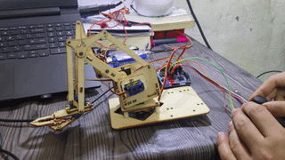

# 🦾 Joystick-Controlled Robotic Arm

A 4-DOF robotic arm control project developed using **Arduino, servo motors, and analog joystick input**. The system converts real-time joystick movement into corresponding servo positions while applying basic signal-processing techniques to achieve smooth and stable motion.



---

## 📌 Overview

This project demonstrates the practical implementation of an embedded motion-control system in which human input is acquired through analog joysticks and translated into coordinated servo movement.

The controller reads joystick positions through the microcontroller's ADC, processes the raw input to reduce noise and unwanted movement, maps the processed values to servo positions, and generates the required control signals for the robotic arm.

The project was developed with a focus on understanding the complete embedded control pipeline:

**Input Acquisition → Signal Processing → Control Mapping → Actuation**

---

## ⚙️ Key Features

* Real-time joystick-based control of a multi-axis robotic arm
* Analog signal acquisition using the microcontroller ADC
* Joystick-to-servo position mapping
* Exponential moving-average filtering for noise reduction
* Dead-zone implementation for stable center positioning
* Servo movement limiting for smoother transitions
* Periodic, non-blocking control updates using `millis()`
* Serial debugging for monitoring input and servo response
* Modular control logic that can be extended to additional joints

---

## 🧠 System Working

The joystick produces a variable analog signal based on its position. The microcontroller samples this signal through its ADC and processes the resulting digital value before converting it into a corresponding servo position.

---

## 🔬 Technical Implementation

### 1. Analog Signal Acquisition

The joystick provides a continuously varying analog voltage. The microcontroller's ADC converts this voltage into a digital representation that can be processed by the firmware.

This provides practical experience with:

* ADC-based sensor/input acquisition
* Analog signal variation
* Sampling and discrete-time processing
* Converting physical movement into digital control data

### 2. Noise Filtering

Raw joystick readings can fluctuate even when the joystick is stationary. An **exponential moving-average filter** is used to smooth these variations.

```text
Smoothed = α × New Value + (1 − α) × Previous Value
```

This demonstrates how simple digital filtering can improve the stability of an embedded control system without requiring additional hardware.

### 3. Dead-Zone Control

A dead zone is introduced around the joystick's neutral position.

Small variations around the center are ignored, preventing minor electrical noise from continuously changing the servo position.

This was particularly useful for reducing unwanted servo jitter during stationary operation.

### 4. Motion Limiting

The firmware limits the maximum change in servo position during each update cycle.

Instead of allowing the servo position to jump directly to a new target:

```text
Current Position → Small Increment → Target Position
```

This produces smoother movement and reduces abrupt changes in the mechanical system.

### 5. Real-Time Control

The controller uses periodic updates based on `millis()` rather than relying on long blocking delays.

This introduces an important embedded-systems concept:

> **The control loop should perform its tasks periodically while keeping the processor available for other operations.**

This approach makes the firmware easier to extend with additional sensors, joints, communication interfaces, or safety logic.

---

## 🛠️ Technologies Used

| Category                | Technologies                        |
| ----------------------- | ----------------------------------- |
| Microcontroller         | Arduino Uno                         |
| Programming             | Embedded C/C++                      |
| Actuation               | Servo Motors                        |
| Input                   | Analog Joystick                     |
| Signal Processing       | Moving-Average Filtering, Dead Zone |
| Control                 | Real-Time Position Mapping          |
| Debugging               | Serial Monitor                      |
| Development Environment | Arduino IDE                         |

---

## 📚 Key Technical Learnings

### Embedded Systems

* Interfacing analog inputs with a microcontroller
* ADC-based data acquisition
* Generating control signals for actuators
* Designing a simple real-time control loop
* Non-blocking timing using `millis()`

### Signal Processing

* Understanding noise in real-world analog signals
* Implementing a simple digital low-pass filtering technique
* Using dead zones to suppress unwanted input variation
* Understanding the trade-off between filtering and response speed

### Motion Control

* Mapping input values to actuator positions
* Controlling multiple servo-based joints
* Limiting position changes for smoother motion
* Understanding the relationship between input resolution and actuator movement

### Debugging

* Monitoring raw and processed data through serial communication
* Comparing expected and actual actuator behavior
* Isolating noise-related motion problems
* Using incremental testing to validate individual control stages

---

## 🎯 Engineering Concepts Demonstrated

This project provided practical exposure to the following embedded-system concepts:

**ADC → Digital Signal Processing → Control Logic → PWM/Servo Actuation → Feedback Through Debugging**

Although the project uses a relatively simple control architecture, the same fundamental structure appears in larger embedded and robotic systems.

---

## 🚀 Possible Future Improvements

* Add feedback-based servo control
* Implement position calibration for individual joints
* Add acceleration/deceleration profiles for smoother trajectories
* Implement wireless control
* Add inverse kinematics for Cartesian-position control
* Add current/torque monitoring for actuator protection
* Introduce a dedicated real-time control architecture
* Add communication between the controller and a higher-level host system

---

## 📁 Repository Structure

```text
ROBOTIC_ARM/
│
├── media/
│   └── robotic_arm.gif
│
├── ROBOTIC_ARM_CODE_FINAL_CODE.ino
│
├── Joystick_Servo_Control_Report.md
│
└── README.md
```

---

## 📄 Technical Documentation

A detailed technical report covering the joystick-to-servo control system, signal processing, filtering, dead-zone implementation, testing, and debugging is available in:

**`Joystick_Servo_Control_Report.md`**

---

## 👨‍💻 Author

**Abhishek Pokhriyal**

Electronics & Communication Engineering
Embedded Systems | Firmware | Robotics

---

⭐ If you find this project useful, feel free to explore the code and documentation.
